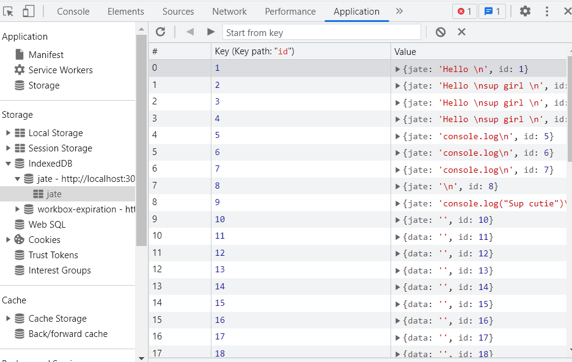

# Text Editor Application 

To view a video of this applications functionality visit the following link: https://drive.google.com/file/d/1U8R-81tzAlQFcpowHH_wuA3DHuCUv4f5/view

  #Table of Content
  - [description](#Description)
  - [installation](#Installation)
  - [usage](#Usage)
  - [credits](#Credits)
  - [license](#License)
  - [contact](#Contact)

  ## Description:
  The purpose behind this project was to build a text editor that runs in the browser and also functions offline. The app is a single-page application that meets the PWA criteria. It also features a number of data persistence techniques that serve as redundancy in case some of the options are not supported by the browser.

  Below you will be able to view a GIF displaying the functionality of this application: 

   

  ## Installation:
  In order to be create this application the following technologies were utilized:
   
    - HTML
    - CSS
    - Express
    - Node
    - idb
    - webpack
    - Javascript

  Something valueable I learned from this application was the ability to create an application that also runs offline. I also wanted to display the applications IndexedDB storage that can be accessed through Chrome dev tools:

  

  Below, I have attached an image that displays the applications manifest.json file:

   

  Here, you can view the application's registered service worker:

   

  ## Usage:
  This application can be utilized by visiting the link below:
  https://evening-cliffs-79205.herokuapp.com/

  If you would like to use this application offline then you can simply click install located on the left hand side of the applciation.

  In order to install the necessary dependencies for this application the following command can be ran within the command line:

  - npm install

  After you will need to build the application utilizing the following command:
  - npm run build

  Finally you can access this within http://localhost:3000 after running: 

  - npm run start

  or you can vist the heroku link above.

  ## Credits:
  I utilized https://gist.github.com/lukas-h/2a5d00690736b4c3a7ba to generate markdown license badges.

 
  ## License:
  MIT 

  ## Contact:
  If you have any question, email me at:  
  allleizq@gmail.com
  I can also be reached through linkedIn:  
  https://www.linkedin.com/feed/